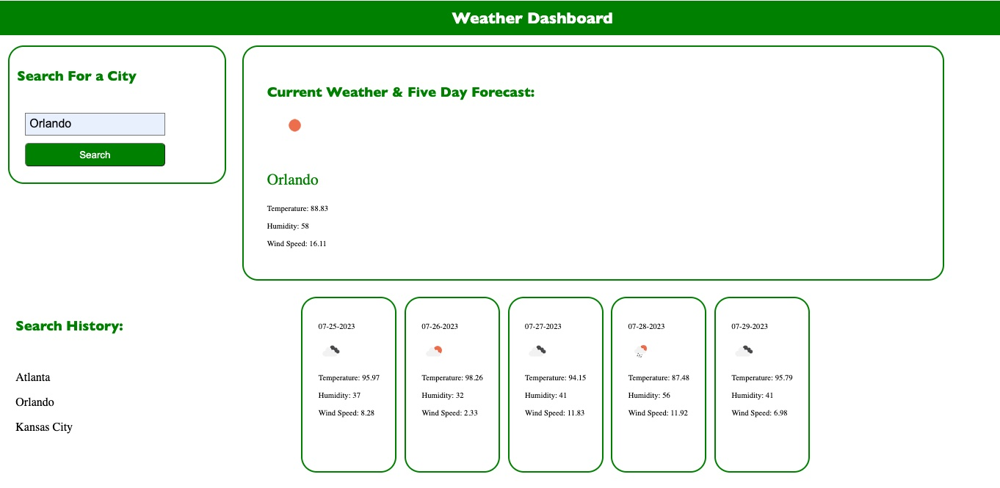

# WeatherDashboardAP

Welcome to this Weather Dashboard! This is a simple application where users can search for a city's weather and retrieve results.

# Features

Users will find the following features with this application:

* When a user opens the app they are presented with a search box and prompted to search for a city.
* When a user searches for a city and submits, the application displays that city's current weather (weather icon, temperature, humidity and wind speen), as well as a five day forecast.
* When a user refreshes the page it displays their search history from previous searches.
* When a user clicks on any city in their search history it presents that city's weather again.

# Credits

For this application I utilized skills learned in Module 6, inluding using bootstrap and the OpenWeatherMaps and Day.js APIs. I had a coaching session with a tutor and received some clarification from a couple of questions asked through the Learning Assistant.

# Screenshot

# Deployed Link

[Here is a link to the deployed application](https://adrummer1.github.io/WeatherDashboardAP/)